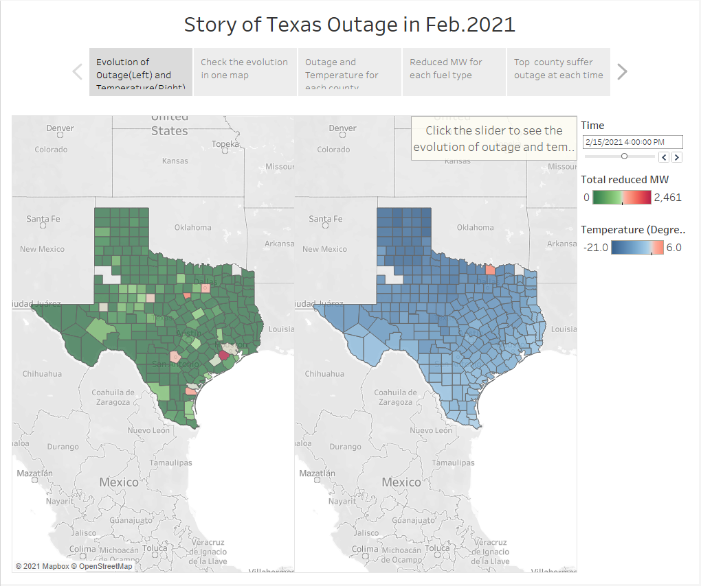

# Visualize_Texas_Outage

**Story Background**: 

I want to visualize the Texas power outage during Feb.10 to Feb.19 hour by hour in Tableau.
* Firstly, collecting outage data, weather history data and Texas county data.
* Secondly, processing the data.
* Lastly, visualizing the processed data in Tableau or visualizing data by Plotly in Notebook.

I collect outage data, weather history data and Texas county data.
- Outage data is from: [ERCOT, Generation Resource and Energy Storage Resource Outages and Derates for February 10-19, 2021 Excel Version](http://www.ercot.com/content/wcm/lists/226521/Unit_Outage_Data_20210312.xlsx).
- Texas county list is from: [Texas-Counties-Centroid-Map](https://data.texas.gov/dataset/Texas-Counties-Centroid-Map/ups3-9e8m/data). Another source is [Wikipedia](https://en.wikipedia.org/wiki/User:Michael_J/County_table).
- Weather history data is from: [Meteostat](https://dev.meteostat.net/python/), weather stations list is [here](https://github.com/meteostat/weather-stations).

**Aboout the FIles**

`Data_Processing_v2.ipynb` or `Data_Processing_v3.ipynb` is the final code to collect and process the data. Please open them to learn details.

`cnty_weather_out_v3.csv` is the final processed data.

**Output**
I used Tableau Public 2021.1 to visualize the data.

Please find the final result:

https://public.tableau.com/profile/ycheng#!/vizhome/ot6_Sorted_Bar_of_Reduced_MW_by_County/Story1

**Images**

